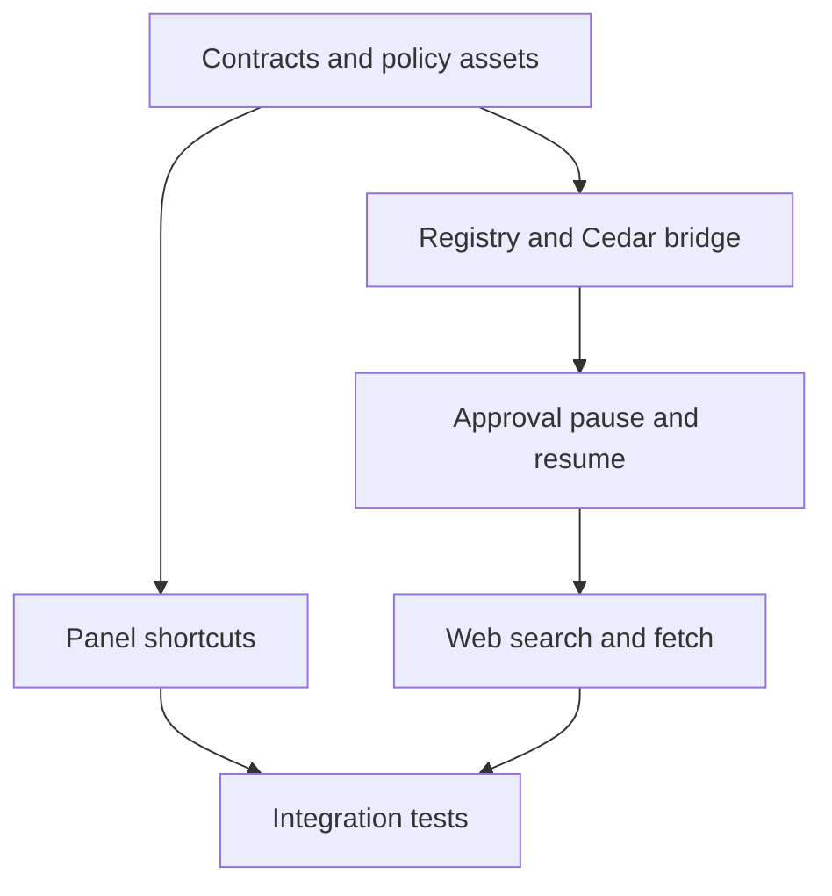

# Tools and shortcuts implementation plan

## Purpose

This plan delivers focused-Panel shortcuts and Nook's first cross-platform tool
platform. It makes web search and page fetching available to the agent only
through a registry, Cedar authorization, and a user approval flow.

The plan does not add MCP servers, terminal access, native system tools, public
MCP discovery, or process sandboxing. The executor boundary keeps those options
open for later work.

## Design source

The functional contract is in [tools and shortcuts](../spec/06-tools-and-shortcuts.md).
[ADR 0004](../adr/0004-cedar-authorizes-tool-requests.md) records the
authorization decision.

## Implementation order

### 1. Define contracts and policy assets

Create the Phase 2 protocol types and examples before changing runtime code.
Add `policy/tools.yaml`, a Cedar schema, and Cedar policy files. Keep the YAML
schema strict so unsupported approval actions fail at startup.

The Panel, Daemon, and Worker must all decode the approval request and decision
messages before later tasks start.

### 2. Add focused-Panel shortcuts

Create a central shortcut dispatcher in the Panel. Register action handlers from
`App.tsx`. Keep browser defaults intact when Nook does not claim a matching
binding.

Add a settings section that records a combination, normalizes platform modifier
names, rejects duplicates, and stores bindings locally. The dispatcher must not
handle the global show-or-hide hotkey.

### 3. Build the registry and policy boundary

Add a Worker tool registry that exposes names, descriptions, schemas,
capabilities, and asynchronous executors. Add the Daemon Cedar authorization
module. The Worker must request authorization from the Daemon before invoking an
executor.

The first registry has only two enabled tools. It must not register placeholders
for future filesystem, terminal, MCP, or system tools.

### 4. Add approval pause and resume

Use Deep Agents' tool interruption support to pause before a tool executor runs.
The Worker forwards approval data to the Daemon. The Daemon tracks a pending call
by Chat and request. The Panel renders the card and submits the decision.

A rejected request returns a tool-rejected result to the agent. `Escape` rejects
the pending call, cancels the reply, and removes the pending-call record before
the user can send another Message.

### 5. Add web tools

Add `ddgs` as a pinned Worker dependency. Call it with the DuckDuckGo backend
explicitly selected. Keep provider output in a small normalized result model.

Implement page fetching with the existing `httpx` dependency. Validate URL
scheme and resolved addresses before connecting and after redirects. Enforce the
configured timeout, redirect count, response-size ceiling, and readable content
types.

### 6. Test and document

Test policy evaluation, grants, contract compatibility, shortcut dispatch,
approval cancellation, DuckDuckGo backend selection, and fetch network guards.
Update the main overview, Worker, Daemon, Panel, and contract specifications to
point at the new specification.

## Dependency graph

## Validation

1. Run contract tests after each protocol change.
2. Run Worker tests with fake search and fetch adapters.
3. Run Daemon tests with a fixed Cedar policy and grant store.
4. Run Panel tests for shortcut collisions and approval-card actions.
5. Run the full cross-platform package workflow after the integration test
   passes.

## Deferred work

The next tool-platform plan owns MCP registration, public MCP discovery,
terminal and filesystem tools, platform-specific system tools, and a sandbox
executor built around Anthropic Sandbox Runtime or a replacement.
