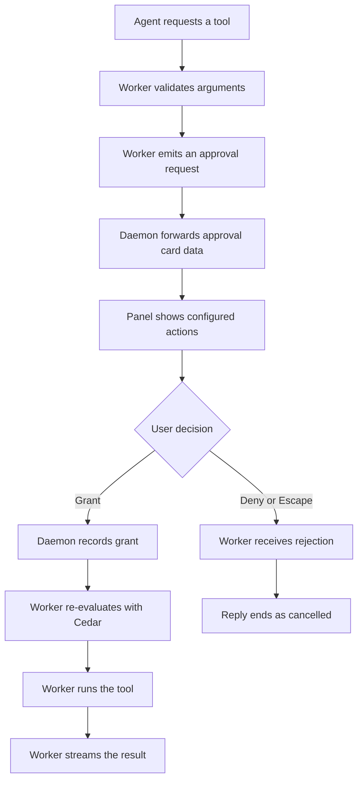

# Tools and shortcuts

## Purpose

This specification defines Nook's focused-Panel shortcuts and the first tool
platform. It adds configurable shortcuts inside the focused Panel, a registry
for built-in tools, DuckDuckGo web search, web page fetching, Cedar
authorization, and approval prompts.

The global hotkey remains separate. It shows or hides the Panel. It does not
invoke focused-Panel actions.

## Scope

This specification adds these active tools:

- `nook:web_search`, which searches DuckDuckGo.
- `nook:web_fetch`, which retrieves a public HTTP or HTTPS page and extracts
  readable text.

This specification also adds:

- Focused-Panel shortcut configuration.
- A registry contract that later tool providers can implement.
- YAML metadata for tools, approval tiers, and prompt actions.
- Cedar policies for final authorization decisions.
- Chat-scoped approval grants.
- Approval cards in the Transcript.

## Out of scope

The following items belong to the next tool-platform specification:

- MCP server registration, discovery, and installation.
- Filesystem, terminal, browser automation, and native system tools.
- Process sandboxing through Anthropic Sandbox Runtime.
- User-editable policy settings.
- Persistent grants for `nook:web_fetch`.
- Image, news, video, and book search.

## Terms

**Focused shortcut**: A key combination that Nook handles only while its Panel
has focus.

**Tool registry**: The Worker-owned catalog of tools that the agent may call.

**Tool request**: One normalized request to invoke a registered tool.

**Approval grant**: A temporary fact that records the user's decision to permit
a tool request.

**Approval tier**: The configured rule that determines whether Nook permits,
asks about, or denies a tool request.

## Shortcut actions

The Panel registers stable action identifiers. Components do not attach their
own global keyboard listeners. One shortcut dispatcher matches focused keyboard
events to an action identifier and invokes the registered action handler.

| Action identifier | Behavior |
| --- | --- |
| `focus_input` | Focus the "Ask anything" input. |
| `new_chat` | Start a fresh Chat when no reply or approval is active. |
| `toggle_history` | Open or close History. |
| `open_settings` | Open Settings. |
| `attach_file` | Open the Attachment picker. |
| `cancel_active_work` | Cancel a streamed reply or a pending approval. |
| `close_auxiliary_view` | Close History or Settings. |

### Defaults

| Action | macOS | Windows and Ubuntu |
| --- | --- | --- |
| Focus input | `Cmd+L` | `Ctrl+L` |
| New Chat | `Cmd+N` | `Ctrl+N` |
| Toggle History | Not set | Not set |
| Open Settings | `Cmd+,` | `Ctrl+,` |
| Attach an Attachment | `Cmd+U` | `Ctrl+U` |
| Cancel active work | `Escape` | `Escape` |
| Close auxiliary view | `Escape` | `Escape` |

The settings view records shortcuts in a Panel-local store. It rejects duplicate
bindings and platform-reserved combinations. The global `Option+Space` on macOS
and `Alt+Space` on Windows and Ubuntu stay outside this store.

## Tool registry

The Worker loads active tools from a registry. Each entry has a stable name,
a LangChain-compatible implementation, structured argument schema, and metadata
from `policy/tools.yaml`.

A registry entry must declare:

- `name`, a unique fully qualified name such as `nook:web_search`.
- `description`, which states what the tool does and when the agent uses it.
- `argument_schema`, which validates tool arguments before policy evaluation.
- `capabilities`, normalized facts used by policy middleware.
- `executor`, which invokes the tool after authorization.

The registry contract does not assume that a tool runs in the Worker process.
An executor returns an asynchronous result and can later delegate to a sandboxed
child process or an MCP client.

## Policy configuration and authorization

Nook keeps tool metadata in `policy/tools.yaml`. The file declares tool names,
capabilities, tiers, and the approval actions that the Panel may display.

Nook keeps Cedar schema and policies in `policy/cedar/`. Cedar policy is the
final authorization rule. YAML is not an authorization language.

Cedar evaluates a normalized request containing:

- The Nook local user as the principal.
- A tool action.
- A resource that identifies the tool target.
- Context including the Chat id, URL scheme, resolved host, approval tier, and
  active approval grant.

Cedar returns `allow` or `deny`. Nook maps a configured approval tier to the
first authorization request:

1. `allow` supplies an automatic grant to Cedar.
2. `ask_once` and `ask_once_per_host` supply no grant. Cedar denies the first
   request and Nook presents an approval card.
3. `ask_each_time` supplies no grant and requires an exact-call grant.
4. `deny` never supplies a grant.

After the user grants approval, Nook stores an immutable, scoped approval grant
in memory and evaluates the same normalized request again. The grant binds
strictly to the Chat id, tool name, and a canonical digest of the validated
arguments, or to the Chat id and normalized host for host-scoped grants. Cedar
permits only a request whose grant matches the target call and required scope.
A grant ends when the Chat ends or the Daemon restarts.

Policy middleware produces facts. It never makes the final authorization
decision. Every registered tool request reaches Cedar.

## Approval tiers and prompt actions

| Tier | Initial behavior | Available grants |
| --- | --- | --- |
| `allow` | Runs without an approval card. | Persistent tool preference for read-only tools. |
| `ask_once` | Shows a card for the exact request. | Exact request. |
| `ask_once_per_host` | Shows a card for a host not approved in this Chat. | Exact request, or the host for this Chat. |
| `ask_each_time` | Shows a card for every request. | Exact request. |
| `deny` | Does not run. | None. |

The Panel builds approval buttons from `policy/tools.yaml`. The metadata file
may expose only actions that Cedar can later authorize for that tool and tier.

The Phase 2 actions are:

- Allow once.
- Allow for this Chat and host, for `nook:web_fetch` only.
- Allow for this Chat, for `nook:web_search` only.
- Always allow, for `nook:web_search` only.
- Deny.

The panel displays the tool name, purpose, arguments, URL or host where present,
reason for the prompt, and the scope of every available action.

## Web tools

### `nook:web_search`

`nook:web_search` accepts a query, region, and result limit. It uses the `ddgs`
Python package with `backend="duckduckgo"` set explicitly. It returns title,
URL, and snippet fields only.

The Worker must pin `ddgs` and its resolved dependency graph in `uv.lock`. The
package is third-party code. Nook does not treat it as trusted input. The Worker
must keep TLS verification enabled and must not expose package options that
disable certificate verification or select a non-DuckDuckGo backend.

### `nook:web_fetch`

`nook:web_fetch` accepts a public `http` or `https` URL. It uses a Nook-owned
`httpx` client rather than `ddgs.extract()`.

Before each request, the Worker validates the URL and resolves the destination
addresses. It rejects non-HTTP schemes, loopback, link-local, multicast,
unspecified, and private addresses. To prevent DNS rebinding attacks, the HTTP
client pins the validated IP address for the TCP connection while preserving the
original Host header and TLS Server Name Indication (SNI). It validates every
redirect target with the same address and pinning checks.

The fetcher applies a fixed timeout, redirect limit, response-size limit, and
allowlist of readable response types. It extracts readable text from supported
HTML and text responses. The final values belong in `policy/tools.yaml` and
must have tests.

Search snippets and fetched page content are untrusted input. They cannot add
or change policy, approval grants, tool metadata, or agent instructions.

## Approval and cancellation flow

1. The agent requests a registered tool.
2. The Worker validates arguments, normalizes the request, and evaluates Cedar.
3. If Cedar denies an approval-tier request, the Worker pauses and sends an
   `approval_requested` event.
4. The Daemon forwards the request to the Panel and preserves the pending call
   id.
5. The Panel shows an inline approval card in the Transcript.
6. The user chooses a configured action or denies the request.
7. The Daemon sends `approval_decision` to the Worker.
8. A grant causes the Worker to evaluate Cedar again and then invoke the tool.
9. A denial resumes the agent with a tool-rejected result.

Pressing `Escape` while an approval card is visible denies the pending request.
The Worker ends the reply with status `cancelled`. The Panel marks the assistant
Message as interrupted, restores input, and accepts the next Message in the same
Chat. A later decision cannot resume the cancelled reply.

## Contracts

`01-contracts.md` owns the complete wire shapes. Phase 2 adds:

- `approval_requested` from Worker through Daemon to Panel.
- `approval_decision` from Panel through Daemon to Worker.
- `tool_call_started` and `tool_call_finished` for executed tools.

An approval request includes a unique call id, the tool name, validated
arguments, explanatory text, available actions, and the resource summary shown
to the user. An approval decision includes the call id and one configured action.

## Failure behavior

| Failure | Result |
| --- | --- |
| Unknown tool | The Worker returns a tool error and does not run code. |
| Invalid arguments | The Worker returns a tool error and does not request approval. |
| Cedar policy or schema invalid at start | The Daemon fails startup closed and reports the configuration error. |
| Approval call id unknown or expired | The Daemon rejects the decision and does not resume a reply. |
| User denies | The tool returns a rejected result; the agent continues the reply. |
| User presses Escape | The Worker ends the reply as `cancelled`. |
| Search provider failure | The Worker returns a retryable tool error. |
| Fetch URL fails validation | The Worker returns a non-retryable tool error. |
| Fetch response exceeds a limit | The Worker stops reading and returns a non-retryable tool error. |
| Redirect resolves to a blocked address | The Worker rejects the redirect and does not connect. |

## Acceptance criteria

1. A focused shortcut runs only while the Nook Panel has focus.
2. The focused shortcut settings view records valid user bindings and rejects
   duplicates and reserved combinations.
3. The global hotkey continues to show or hide the Panel and does not invoke a
   focused action.
4. The Worker exposes only `nook:web_search` and `nook:web_fetch` as active
   tools.
5. `nook:web_search` uses the DuckDuckGo backend explicitly and returns
   structured results.
6. `nook:web_fetch` rejects blocked addresses before connecting, pins the
   validated IP to prevent DNS rebinding, and validates every redirect.
7. Every tool request is validated and evaluated by Cedar before execution.
8. A pending approval card shows only actions listed for that tool in YAML.
9. A Chat and host approval for `nook:web_fetch` does not authorize a different
   host.
10. Pressing `Escape` during approval cancels the reply, restores input, and
    prevents a later decision from resuming it.
11. Contract examples cover approval requests, decisions, grants, denials, and
    cancellation.

## Sources

- [Cedar policy language](https://docs.cedarpolicy.com/)
- [Cedar policy formats](https://docs.cedarpolicy.com/policies/json-format.html)
- [DDGS package metadata](https://pypi.org/project/ddgs/)
- [DDGS source repository](https://github.com/deedy5/ddgs)
- [Anthropic Sandbox Runtime](https://github.com/anthropics/sandbox-runtime)
